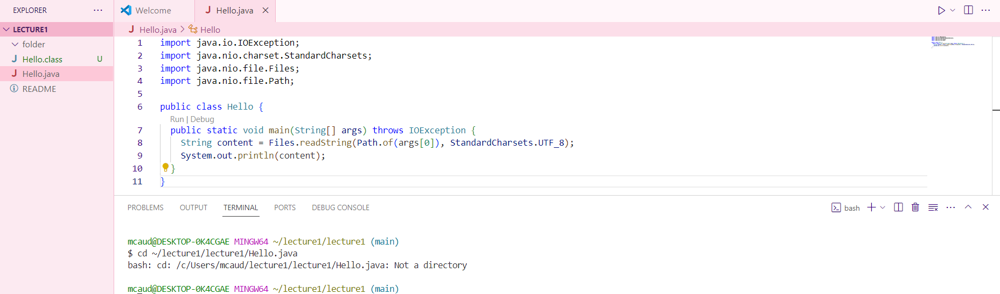
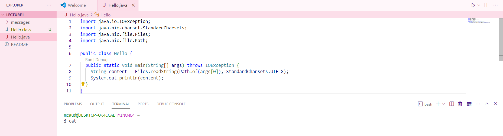

# Lab Report 1 - Remote Access and FileSystem
## `$ cd`
> `$ cd`
> 
> * **Absolute** path to the working directory **before** the command was run: ~/lecture1/lecture1
> * There was no output because it goes to the home directory (~).
> * This output is not an error.

> `$ cd ~/lecture1/lecture1/folder`
> 
> * **Absolute** path to the working directory **before** the command was run: ~/lecture1/lecture1
> * There was no output because it changes the directory to ~/lecture1/lecture1/folder.
> * This output is not an error.

> `$ cd ~/lecture1/lecture1/Hello.java`
> 
> * **Absolute** path to the working directory **before** the command was run: ~/lecture1/lecture1
> * I got this output because Hello.java is not a directory, therefore I cannot change my working directory using `cd` to Hello.java.
> * No this output is not an error.

## `$ ls`
> `$ ls`
>  
> * **Absolute** path to the working directory **before** the command was run: ~
> * Why did I get this output?
> * Is this output an error?

> `$ ls path to directory`
> 
> * **Absolute** path to the working directory **before** the command was run:
> * Why did I get this output?
> * Is this output an error?

> `$ ls path to file`
> 
> * **Absolute** path to the working directory **before** the command was run:
> * Why did I get this output?
> * Is this output an error?

## `$ cat`
> `$ ls`
> 
> * **Absolute** path to the working directory **before** the command was run: ~
> * Why did I get this output?
> * Is this output an error?

> `$ ls path to directory`
> 
> * **Absolute** path to the working directory **before** the command was run:
> * Why did I get this output?
> * Is this output an error?

> `$ ls path to file`
> 
> * **Absolute** path to the working directory **before** the command was run:
> * Why did I get this output?
> * Is this output an error?
