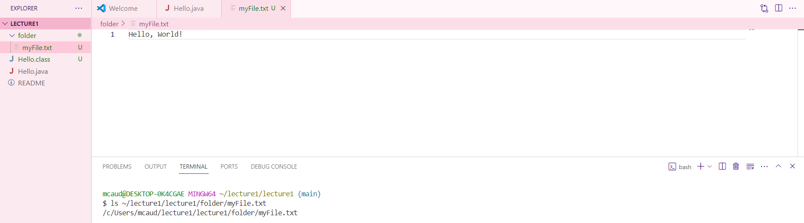

# Lab Report 1 - Remote Access and FileSystem
## `$ cd`
> `$ cd`
> 
> * **Absolute** path to the working directory **before** the command was run: ~/lecture1/lecture1
> * There was no output because it goes to the home directory (~).
> * This output is not an error.

> `$ cd ~/lecture1/lecture1/folder`
> 
> * **Absolute** path to the working directory **before** the command was run: ~/lecture1/lecture1
> * There was no output because it changes the directory to ~/lecture1/lecture1/folder.
> * This output is not an error.

> `$ cd ~/lecture1/lecture1/Hello.java`
> 
> * **Absolute** path to the working directory **before** the command was run: ~/lecture1/lecture1
> * I got this output because Hello.java is not a directory, therefore I cannot change my working directory using `cd` to Hello.java.
> * No this output is not an error.

## `$ ls`
> `$ ls`
>  
> * **Absolute** path to the working directory **before** the command was run: ~/lecture1/lecture1
> * I got this output because these are the files and folders within the given path.
> * This output is not an error.

> `$ ls ~/lecture1/lecture1/folder`
> 
> * **Absolute** path to the working directory **before** the command was run: ~lecture1/lecture1
> * I got this output because myFile.txt is the only file inside the directory ~/lecture1/lecture1/folder
> * This output is not an error

> `$ ls ~/lecture1/lecture1/folder/myFile.txt`
> 
> * **Absolute** path to the working directory **before** the command was run: ~/lecture1/lecture1
> * I got this output because there are no files and folders in the given path.
> * This output is not an error.

## `$ cat`
> `$ cat`
> 
> * **Absolute** path to the working directory **before** the command was run: ~/lecture1/lecture1
> * I got this output because there are no contents in the files given by the path that can be printed by this command.
> * This output is not an error.

> `$ cat ~/lecture1/lecture1/folder`
> 
> * **Absolute** path to the working directory **before** the command was run: ~/lecture1/lecture1
> * I got this output because there is nothing inside this directory that can be printed by this command.
> * This output is not an error.

> `$ cat ~/lecture1/lecture1/folder/myFile.txt`
> 
> * **Absolute** path to the working directory **before** the command was run: ~/lecture1/lecture1
> * I got this output because "Hello, World!" is the contents of this file.
> * This output is not an error.
