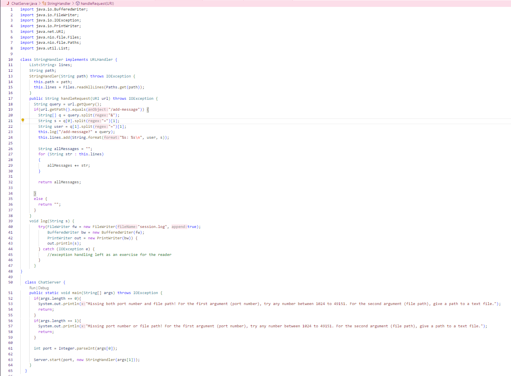
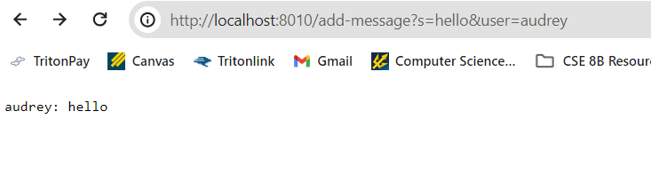
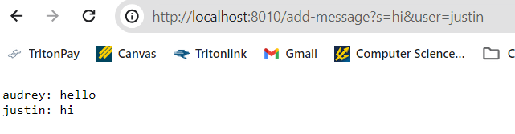
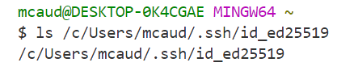
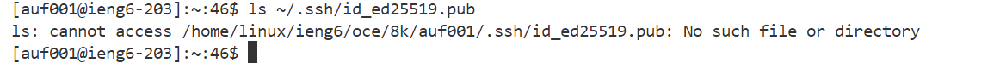
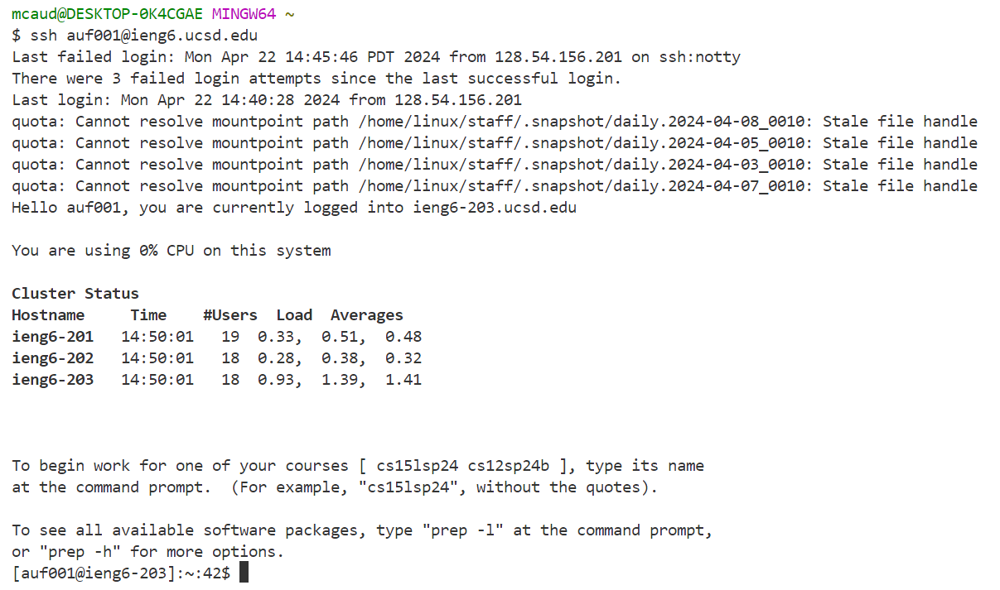

# Lab Report 2 - Servers and SSH Keys

## Part 1
my code:

Using `/add-message`: 

* Calls the `handleRequest` method from my code
* `handleRequest` takes the URL as an argument
Relevant fields:
* `lines`: a String ArrayList which holds all the messages exchanged in a `ChatServer`
* `path`: a String representing the path of the text document that is being read

* Calls the `handleRequest` method from my code
* `handleRequest` takes the URL as an argument
Relevant fields:
* `lines`: a String ArrayList which holds all the messages exchanged in a `ChatServer`
* `path`: a String representing the path of the text document that is being read

## Part 2
1.

2.

3.

## Part 3
One thing I learned from labs in weeks 2 and 3 was how to build and run a server. I liked learning how to build a server and run it locally on a port. Up until now, I could only see the output of my code from the terminal in VSCode, so I think it is really cool that now I can input and see the output from my browser.
