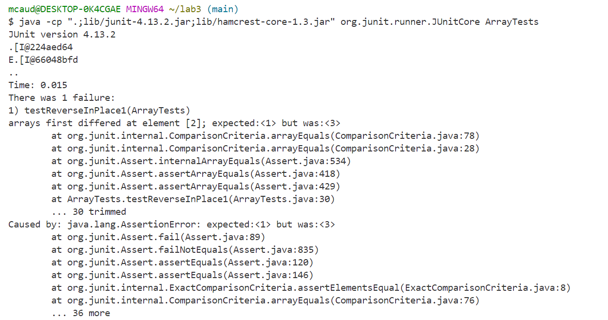
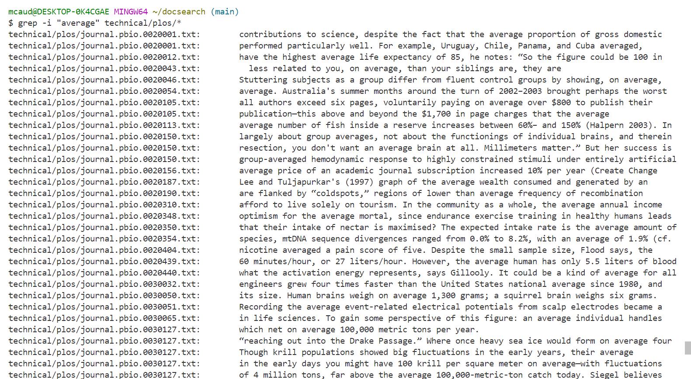
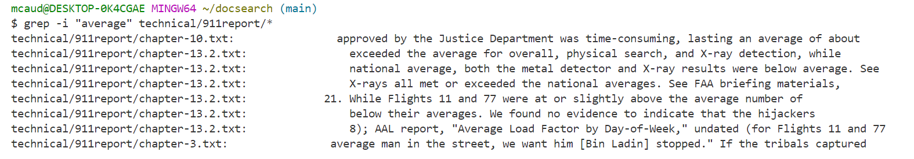
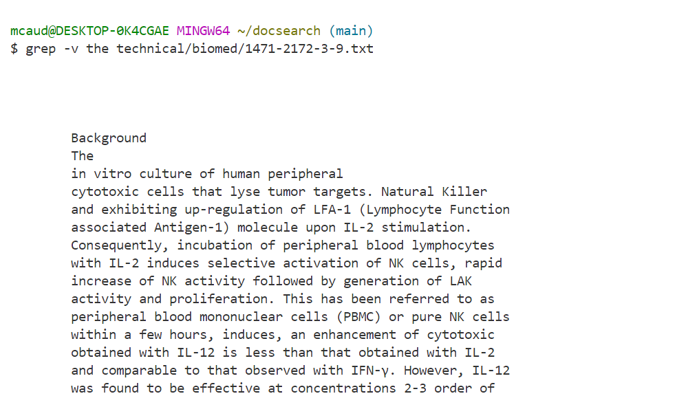
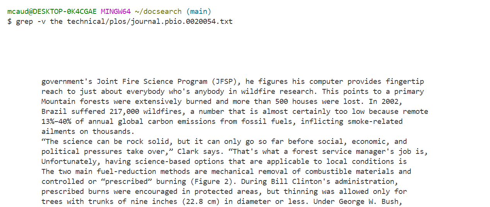
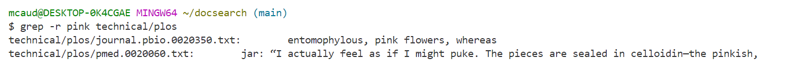
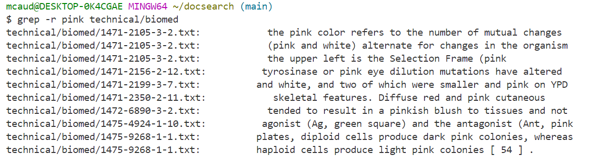
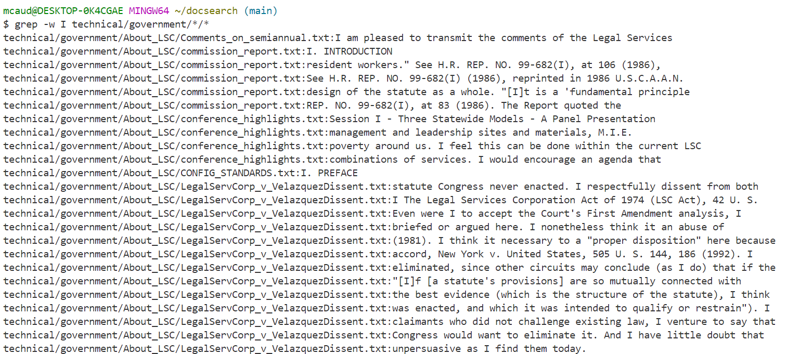
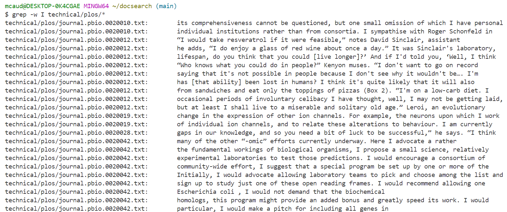

# Lab Report 3 - Bugs and Commands

## Part 1 - Bugs

`reverseInPlace(int[] arr)`
#### 1. A failure-inducing input for the buggy program as a **JUnit test**
```
@Test
public void testReverseInPlace1(){
  int[] input = { 1, 2, 3 };
  ArrayExamples.reverseInPlace(input1);
  assertArrayEquals(new int[]{ 3, 2, 1 }, input1);
}
```
#### 2. An input that *doesn't* induce a failure
```
@Test 
	public void testReverseInPlace() {
    int[] input1 = { 3 };
    ArrayExamples.reverseInPlace(input1);
    assertArrayEquals(new int[]{ 3 }, input1);
	}
```

#### 3. The Symptom (The output of running the two tests shown above)


#### 4. The Bug (Before and After)
Buggy Code (Before):
```
static void reverseInPlace(int[] arr){
	for(int i = 0; i < arr.length; i += 1){
		arr[i] = arr[length - i - 1];
	}
	System.out.println(arr);
```

After:
```
static void reverseInPlace(int[] arr){
	int[] copy = new int[arr.length];
	copy = arr.clone();
	for(int i = 0; i < arr.length; i += 1){
		arr[i] = copy[arr.length - i - 1];
	}
	System.out.println(arr);
```

#### 5. Explaining the Solution
The issue with the original code was that the method was updating the array based on existing elements in the array. This means that the method mirrors the first half of the array onto the second half. The solution to fixing this bug is to make a clone of the original array, so that the array be updated with respect to the elements in the copy array.

## Part 2 - Researching Commands

The command I selected is `grep`. The article I used is: [How to Use the grep Command on Linux](https://www.howtogeek.com/496056/how-to-use-the-grep-command-on-linux/)

#### 1. `grep -i`


`grep -i` ignores case (uppercase/lowercase)

#### 2. `grep -v `


`grep -v` displays all non-matching lines.

#### 3. `grep -r`


`grep -r` searches all files in a directory recursively

#### 4. `grep -w`


`grep -w` matches separate words only

Every mode I have explored above, I learned through the article [How to Use the grep Command on Linux](https://www.howtogeek.com/496056/how-to-use-the-grep-command-on-linux/) by Dave McKay
